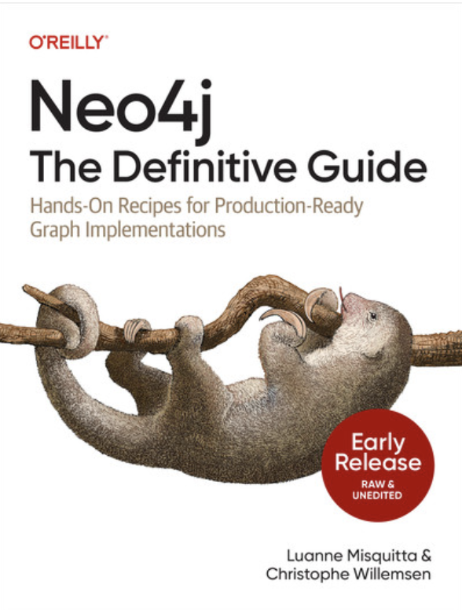

# Neo4j - The Definitive Guide: Companion Repository



Welcome to the companion repository for the book **"Neo4j - The Definitive Guide"** published by O'Reilly. This repository contains the code examples and Docker configuration to help you follow along with the chapters of the book. The examples provided cover Cypher queries and Python code to demonstrate various concepts discussed in the book.
The book uses the most recently released LTS version of Neo4j, currently 5.26. If you're using an earlier version and some queries do not work, upgrade your version to the latest.
## Repository Structure

The repository is structured into multiple directories, each of which corresponds to a chapter of the book. There is also a Docker configuration provided for easy setup of Neo4j for use with the examples.

### Chapter Directories (`chapter..`)

Each chapter directory (e.g., `chapter01`, `chapter02`, etc.) contains the code examples relevant to that chapter. Inside each chapter directory, you'll find:

- **Cypher Queries**: `.cypher` files containing the Cypher code used to query the database.
- **Python Scripts**: Python code demonstrating integration with Neo4j using the `neo4j` Python driver.

### Docker Directory (docker)

The docker directory contains the main configuration to run Neo4j inside a Docker container. This is the preferred method to set up and run Neo4j for the book examples. The Docker setup ensures that the environment is consistent across different platforms, minimizing potential configuration issues.

Docker Setup

**Clone the repository**

```bash
git clone https://github.com/neo4j-the-definitive-guide/book.git
cd book/docker
```

**Run Neo4j in Docker**

Use the provided docker-compose.yml to spin up a Neo4j instance.

```bash
docker-compose up
```

This will start a Neo4j instance with the configurations defined in the docker-compose.yml file. The database will be available at http://localhost:7474 and can be accessed via a web browser or programmatically through the Neo4j drivers.


**Running the Python scripts**

We recommend using a virtual environment (venv) for running the Python scripts to manage dependencies effectively.

1. Install `venv`:

```bash
python -m venv venv
```

2. Activate the virtual environment:

```bash
source venv/bin/activate
```

3. Install the Neo4j driver

```bash
pip install neo4j
```

### Contributing
Contributions are welcome! If you find any issues, feel free to create a pull request.

## Acknowledgements
The dataset used in these exercises is taken from the Spotify Dataset 2023 on Kaggle, provided by Tony Gordon Jr. https://www.kaggle.com/datasets/tonygordonjr/spotify-dataset-2023